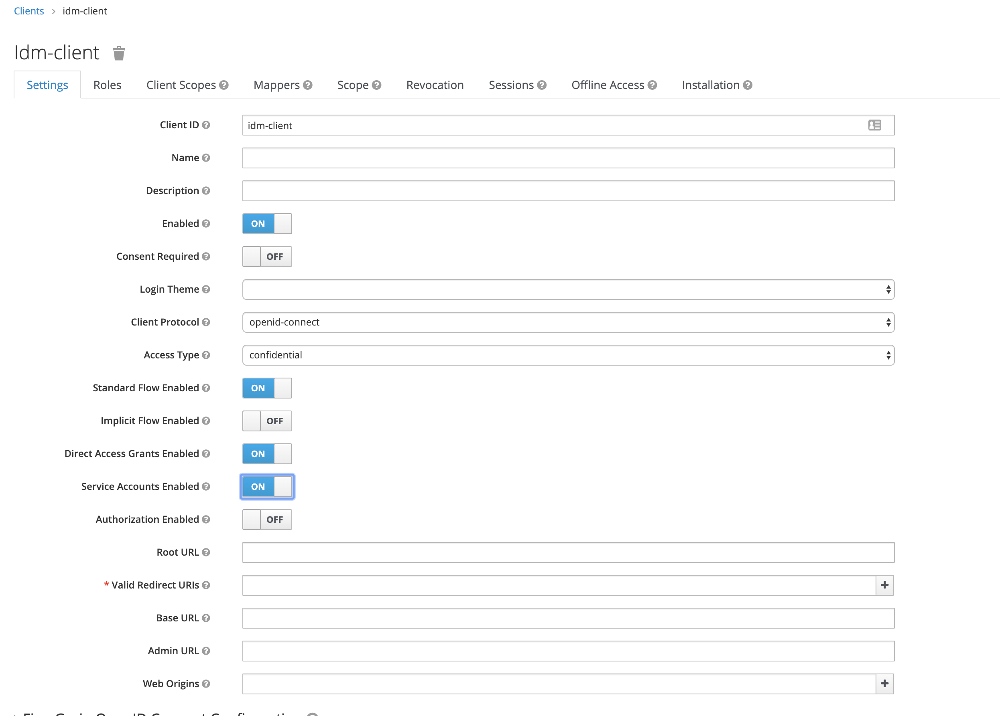
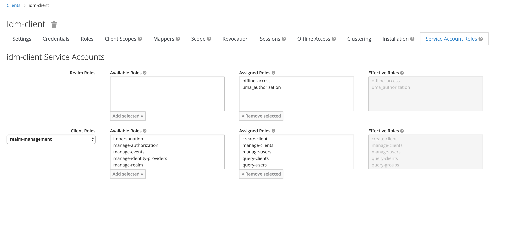

# jdk-keycloak-admin

Spring auto-configured library to add keycloak admin support.

**The dependencies and keycloak docker image in the integration test of this library are currently written for Keycloak 9.**
**It is important that this library is used with that version of Keycloak.**
**Future releases of this library can support other versions of Keycloak if dependency versions of Keycloak and the integration test is adapted.**

## Features

### Clients

- Retrieving clients for the realm
- Creating clients for the realm
- Adding client roles
- Removing client roles

### Users

- Creating a user
- Retrieving all users
- Get a user with client roles
- Add client role to user
- Remove client role from user

## Configuration

**Application properties to be configured:**

| name                               | purpose |
|------------------------------------|---------|
| keycloak-admin.auth-server-url     | Keycloak auth server url, which is the same as the configuration for the keycloak spring adapter. |
| keycloak-admin.realm               | The keycloak realm you want to configure |
| keycloak-admin.client-id           | Special client which has realm management rights. See configuring admin client. |
| keycloak-admin.client-secret       | Speaks for itself |

**Configuring an admin client in Keycloak**

Go to your realm and create a new client.


* Alter access type to `confidential`.
* Alter `Service Accounts Enabled` to on.
* Enter `*` in Valid Redirect URIs.
* Click save!



Go to the Service Account Roles tab

* Select `realm-management` in client roles
* Add the following roles
    * create-client
    * manage-clients
    * manage-users
    * query-clients
    * query-users
    * view-realm
    * view clients
    * view-users
    

    
You have now created a client you can use for administrating your realm.
Use the name of the client `idm-client` and the `secret` value from the credentials tab in the application properties stated above. 

## Usage

### Keycloak client and roles migration in application example

```java
package be.jidoka.cv.app.infrastructure.keycloak;

import be.jidoka.cv.app.authorization.Role;
import be.jidoka.jdk.keycloak.admin.domain.Client;
import be.jidoka.jdk.keycloak.admin.domain.ClientRole;
import be.jidoka.jdk.keycloak.admin.service.KeycloakClientAdminService;
import org.springframework.beans.factory.annotation.Autowired;
import org.springframework.beans.factory.annotation.Value;
import org.springframework.stereotype.Component;

import javax.annotation.PostConstruct;
import java.util.Optional;
import java.util.Set;

@Component
public class KeycloakClientMigrations {

	@Autowired
	private KeycloakClientAdminService keycloakClientAdminService;

	@Value("${keycloak.resource}")
	private String keycloakResource;

	@Value("${keycloak-admin.app-root-url}")
	private String applicatonRootUrl;

	@PostConstruct
	public void init() {
		Optional<Client> optionalClient = keycloakClientAdminService.getClient(keycloakResource);
		Client client = optionalClient.orElseGet(this::createClient);

		Set<ClientRole> currentClientRoles = keycloakClientAdminService.getClientRoles(client);
		addRoleIfNotFound(client, currentClientRoles, Role.EMPLOYEE.name());
		addRoleIfNotFound(client, currentClientRoles, Role.PROJECT_MANAGER.name());
		addRoleIfNotFound(client, currentClientRoles, Role.HR.name());
		addRoleIfNotFound(client, currentClientRoles, Role.ADMIN.name());
	}

	private void addRoleIfNotFound(Client client, Set<ClientRole> currentClientRoles, String role) {
		boolean doesNotHaveRole = currentClientRoles.stream()
				.noneMatch(clientRole -> clientRole.getRoleName().equals(role));

		if (doesNotHaveRole) {
			keycloakClientAdminService.createClientRole(new CreateCvAppKeycloakClientRole(client.getId(), role));
		}
	}

	private Client createClient() {
		keycloakClientAdminService.createPublicClient(new CreateCvAppKeycloakClient(keycloakResource, applicatonRootUrl));
		return keycloakClientAdminService.getClient(keycloakResource).get();
	}
}
```

## Development FAQ

### The dependency-check (OWASP) fails on github but not locally
Make sure to clear your vulnerability cache of the maven dependency check plugin locally.
You can do this by executing `./mvnw dependency-check:purge`.
If you now rerun the build locally it will re-populate the vulnerability database and should fail the build. 
 
